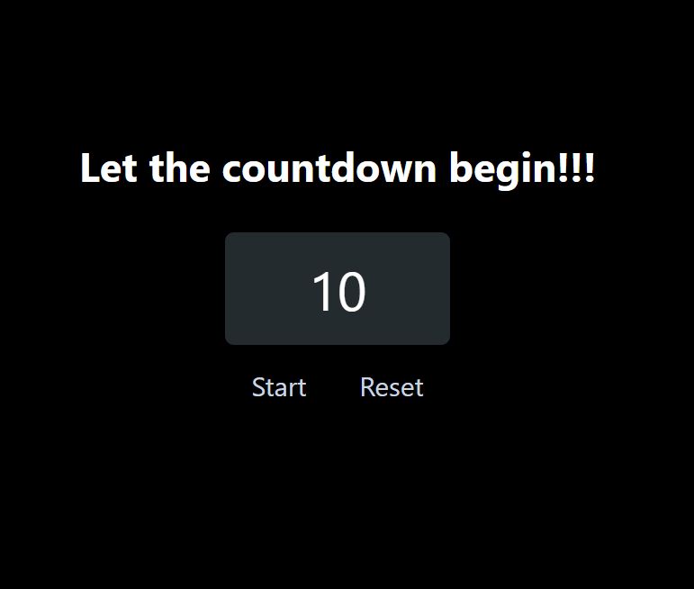
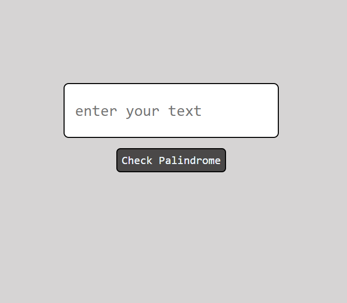
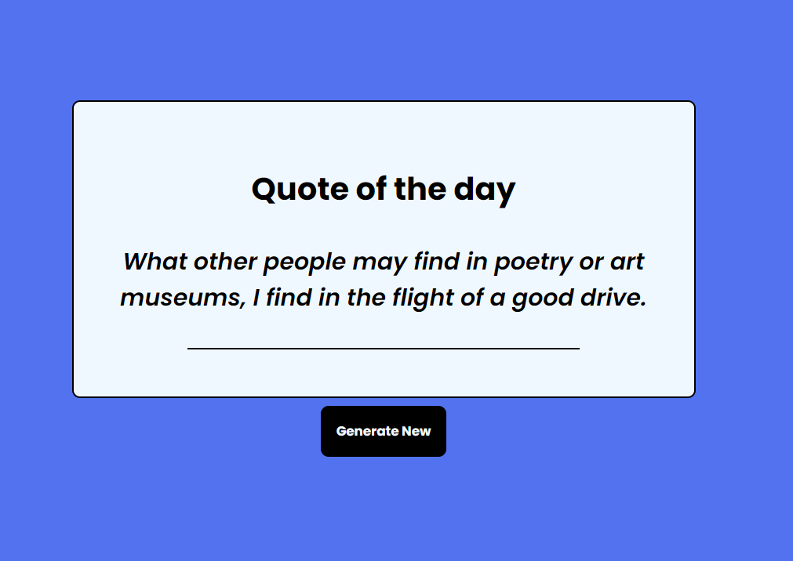
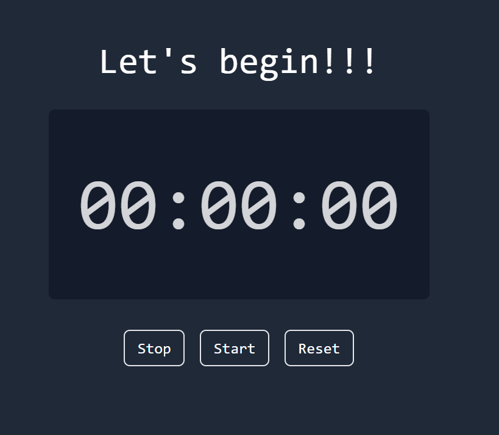
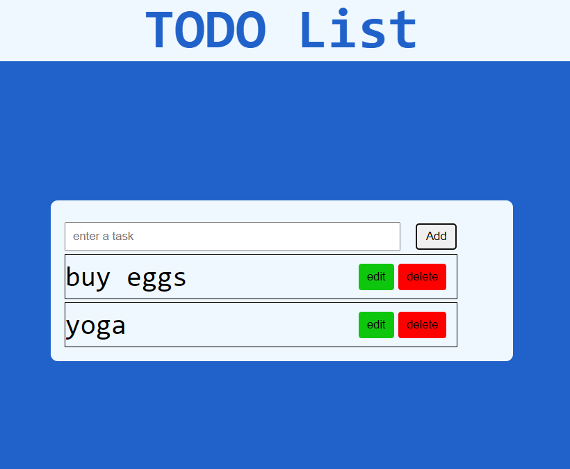
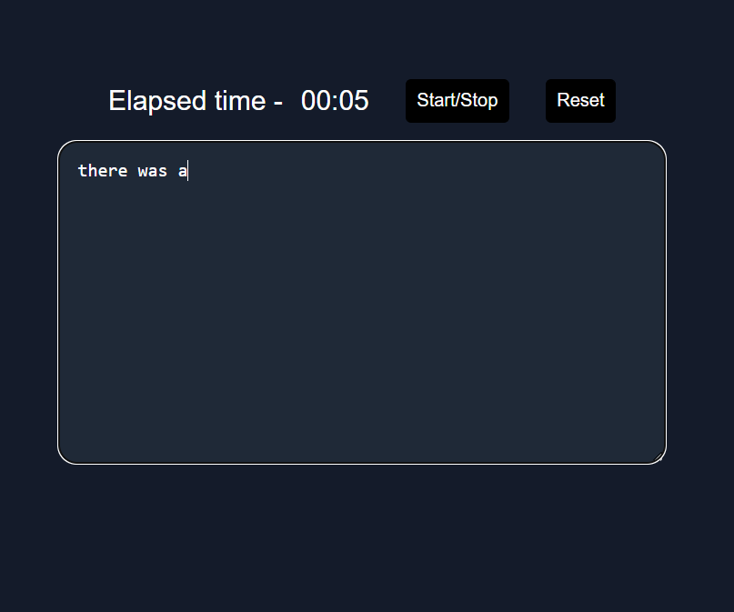
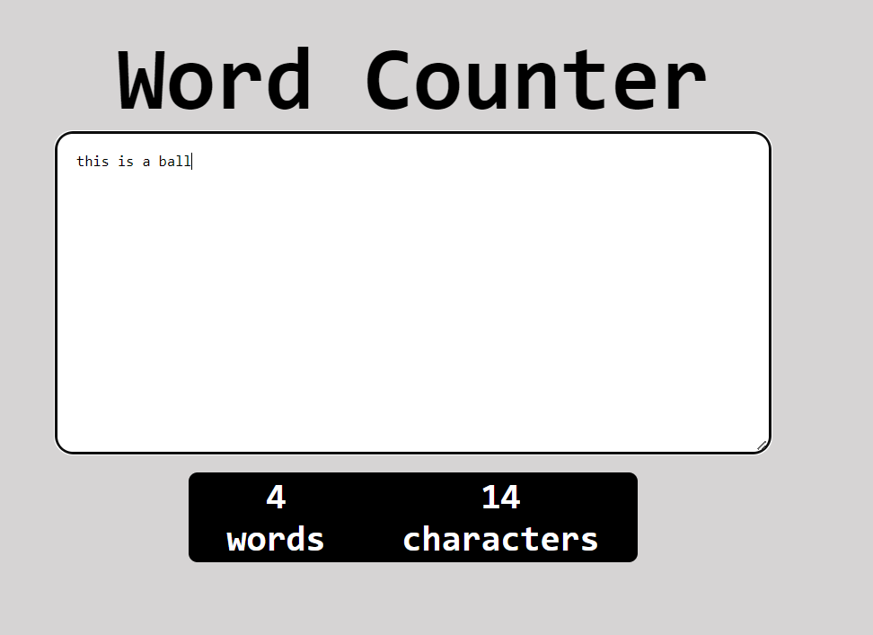

# Project 01 - Accordian

 

## Links

[Live Preview](https://js-project-fsjs-countdown.netlify.app/) | [Source Code](https://github.com/Saurabh-Singh-Negi/js-projects-fsjs/tree/master/countdown)

# Project 02 - Palindrome Checker

 

## Links

[Live Preview](https://js-project-fsjs-palindromechecker.netlify.app/) | [Source Code](https://github.com/Saurabh-Singh-Negi/js-projects-fsjs/tree/master/palindrome_checker)

# Project 03 - Quotes Generator

 

## Links

[Live Preview](https://js-project-fsjs-quotesgenerator.netlify.app/) | [Source Code](https://github.com/Saurabh-Singh-Negi/js-projects-fsjs/tree/master/quotes_generator)

# Project 04 - Stopwatch

 

## Links

[Live Preview](https://js-project-fsjs-stopwatch.netlify.app/) | [Source Code](https://github.com/Saurabh-Singh-Negi/js-projects-fsjs/tree/master/Stopwatch)

# Project 05 - Todo App

 

## Links

[Live Preview](https://js-project-fsjs-todo.netlify.app/) | [Source Code](https://github.com/Saurabh-Singh-Negi/js-projects-fsjs/tree/master/todo_app)

# Project 06 - Typing Game

 

## Links

[Live Preview](https://js-project-fsjs-typinggame.netlify.app/) | [Source Code](https://github.com/Saurabh-Singh-Negi/js-projects-fsjs/tree/master/typing_game)

# Project 07 - Word Count

 

## Links

[Live Preview](https://js-project-fsjs-wordcount.netlify.app/) | [Source Code](https://github.com/Saurabh-Singh-Negi/js-projects-fsjs/tree/master/word_count)